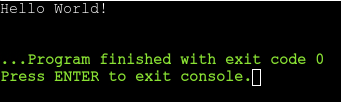
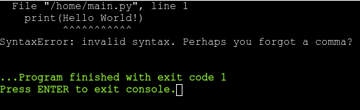
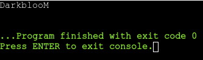
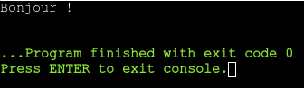
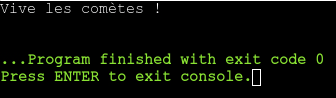
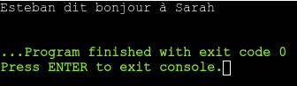
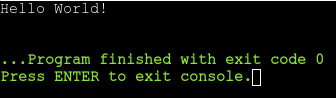

<h1 align="center">Apprendre à programmer<br>Chapitre 1 : les bases</h1>

On va passer en revue des concepts de base à connaitre pour bien débuter en programmation.

Pendant tout le long j'utiliserai le langage Python, qui est un langage simple à comprendre et à écrire, mais également très versatile, ce qui en fait un choix idéal pour les débutants.

Tu es libre de choisir un autre langage si tu le souhaites mais garde en tête que tu devras adapter la syntaxe et la structure de ton code en accord avec le langage de ton choix.

Rends-toi sur [OnlineGDB](https://www.onlinegdb.com/) et sélectionne Python 3 dans le menu déroulant en haut à droite. Tu peux ensuite effacer le code présent par défaut dans l'éditeur.

## I. Premiers pas

Commençons par une tâche simple : afficher du texte à l'écran.

Dans ton éditeur, recopie le code suivant :

```python
print("Hello World!")
```

Puis, clique sur le bouton vert en haut à gauche pour lancer ton programme.

Si tout va bien le résultat devrait ressembler à quelque chose dans ce style :
<br>


OK, décortiquons ce qu'il vient de se passer. Dans ce programme, on appelle la fonction `print` et on lui donne la phrase `Hello World!` sous forme de chaîne de caractères.

Wow, j'ai dit des gros mots. Quelques explications s'imposent.

### Définitions
- **Fonction :** bloc de code qui effectue une tâche spécifique et peut être appelé à plusieurs reprises dans un programme pour éviter la redondance du code.
- **Chaîne de caractères :** une chaîne de caractères, plus communément appelée "string", est une séquence de caractères, tels que des lettres, des chiffres ou des symboles, regroupés ensemble. Une string est définie par du texte placée entre deux guillemets simples (`'`) ou doubles (`"`).

> <span style="font-size: .9rem">**Note :** il n'y a pas de différence entre les guillemets simples et doubles en Python, mais il peut y en avoir dans d'autres langages !</span>

La fonction `print` est intégrée à Python et permet d'afficher du texte mais aussi d'autres types de valeur. On repassera plus en détail sur les fonctions plus tard.

Pour en revenir à la chaîne de caractères, on remarque la présence de guillemets. Voyons ce qu'il se passe si on les enlève :

```python
print(Hello World!)
```



Ouch. Nous voilà face à notre première erreur. Familiarise-toi avec ce genre de message parce que tu vas en voir beaucoup.

En l'absence de guillemets, le programme ne sait pas où commence la chaîne ni où elle finit. On peut même considérer que la chaîne n'existe tout simplement pas.

### Pour pratiquer

Crée un programme qui utilise la fonction `print` pour afficher à l'écran :
- ton nom;
- ton âge;
- ta passion.

**Bonus :** essaie de tout afficher sur trois lignes en une seule ligne de code.

## II. Les variables

Un des concepts les plus importants en programmation est celui des variables.

### Définition

- **Variable :** une variable est un élément permettant de stocker une valeur et d'y accéder n'importe quand et n'importe où dans un programme.

Ce sera plus clair si je te montre. On va utiliser une variable pour stocker notre nom et l'afficher via la fonction `print`.

```python
nom = "DarkblooM"
print(nom)
```

Ici, on assigne la chaîne de caractères `DarkblooM` à une variable qu'on appelle `nom`, puis on affiche la valeur stockée en donnant cette même variable `nom` à la fonction `print`.

Voyons ce que ça donne :
<br>


Parfait ! Notre nom apparaît correctement.

Tu te demande peut-être : *Mais du coup quel est l'intérêt ?*
<br>

Tu as raison de te poser la question, laisse moi répondre avec un exemple tout bête :

```python
print("C'est l'histoire d'un jeune homme appelé Valentin.")
print("Valentin aime beaucoup les pommes, alors il va au marché pour en acheter.")
print("Valentin a des pommes, il est heureux.")
```

Ici, on raconte l'histoire d'un jeune homme qui aime beaucoup les pommes. On voit que son nom revient régulièrement dans le texte.

Imagine maintenant que tu doive changer le nom du jeune homme. Il faudrait passer en revue l'entièreté du code et modifier le texte à chaque fois que le nom est cité (ici y en a que trois mais imagine un programme de 200 lignes, ça parait plus décourageant).

Voyons ce que ça donne avec une variable :

```python
nom = "Valentin"

print("C'est l'histoire d'un jeune homme appelé", nom)
print(nom, "aime beaucoup les pommes, alors il va au marché pour en acheter.")
print(nom, "a des pommes, il est heureux.")
```

> <span style="font-size: .9rem">**Note :** remarque les virgules utilisée dans la fonction `print`. Elles servent à séparer les différents que l'on veut afficher ensemble.</span>

C'est tout de suite plus confortable. Si on veut changer le nom du jeune homme, il suffit de changer la chaîne de caractères assignée à la variable `nom`.

### Pour pratiquer

Reprends ton code de la partie précédente, mais cette fois-ci, utilise des variables pour stocker ton nom, ton âge et ta passion, et utilise ensuite ces variables pour afficher leurs valeurs.

## III. Les fonctions

Comme on l'a vu précédemment, une fonction est un bout de code qui peut être appelé à tout moment dans un programme.

Jusque là on s'est familiarisé avec la fonction `print`, qui est une fonction de base de Python parmi beaucoup d'autres.

Mais il est également possible de créer ses propres fonctions, et là vient tout l'intérêt.

Exemple :

```python
def direBonjour():
	print("Bonjour !")

direBonjour()
```

> <span style="font-size: .9rem">**Note :** fais attention à l'[indentation](https://fr.wikipedia.org/wiki/Style_d%27indentation) (c'est à dire les espaces au début de chaque ligne) car elle joue un rôle crucial en Python. Ici, la ligne `print("Bonjour !")` est avancée et fait donc partie de la fonction `direBonjour` définie juste au dessus.</span>

Résultat :
<br>


Cet exemple est relativement simpliste mais une fonction peut faire bien plus que juste en appeler une autre.

L'en-tête d'une fonction est composé du mot clé `def`, suivi d'une paire de parenthèse (j'expliquerai leur utilité plus tard) et, pour finir, deux points.

Le but premier d'une fonction est d'éviter les répétitions dans le code.

Si par exemple je veux dire bonjour plusieurs fois dans mon programme, au lieu d'appeler `print` et de lui passer le mot `Bonjour` à chaque fois, il me suffit d'appeler ma fonction `direBonjour` et le tour est joué !

Mais qu'est-ce qui se passe si on utilise une fonction et des variables ensemble ?

Il est possible de définir des variables spécifiques à une fonction. On les appelle alors des paramètres.

```python
def parler(message):
	print(message)

parler("Vive les comètes !")
```

Voyons ce que ça donne :
<br>


Voilà qui est pratique ! Dans cet exemple, on associe le paramètre `message` à la fonction `parler`. Ce paramètre peut ensuite être utilisé comme une variable n'importe où à l'intérieur de la fonction.

Une fonction peut prendre plusieurs paramètres :

```python
def saluer(personne1, personne2):
	print(personne1, "dit bonjour à", personne2)

saluer("Esteban", "Sarah")
```

Ce qui nous donne :
<br>


### Pour pratiquer

Toujours le même sujet que les parties précédentes, mais cette fois tu dois créer une fonction qui pourra afficher ton nom, ton âge et ta passion.

## IV. Les commentaires

Un élément qui paraît anodin mais qui est en réalité très important : les commentaires.

### Définition

- **Commentaire :** un commentaire est une ligne dans un programme qui est ignorée par l'interpréteur et est uniquement destinée aux développeurs.

Les commentaires sont utiles pour décrire ou expliquer une portion de code, ou pour laisser des instructions à l'attention d'un autre développeur.

```python
# Cette ligne est un commentaire !

print("Hello World!")

# Ces lignes
# sont ignorées
# par l'interpréteur
```
<br>



Les commentaires sont définis par un symbole `#` en début de ligne.
